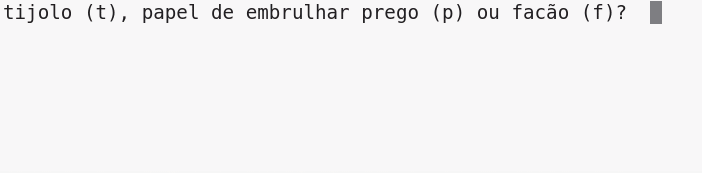

# Mão na massa sem pantim com Python, visse?

## O que faremos: 



### Passo a passo do joguinho:

**1** - Primeiro, importaremos a biblioteca randint e em seguida pediremos que o jogador escolher entre tijolo, papel de embrulhar prego e facão, digitando alguma das iniciais em minúsculo:
``` python
  from random import randint

  jogador = input(player = input('tijolo (t), papel de embrulhar prego (p) ou facão (f)? '))
```

**2** - Agora imprima a escolha do jogador:
``` python
  print(jogador, 'versus')
```

**3** - Chegou a vez do computador. Vamos usar a função que importamos __randint__ para gerar um número aleatório para decidir entre as três opções Tijolo, Papel de embrulhar prego e Facão:
```python
  escolhido = randint(1,3)
  print(escolhido)
```

**4** - Nesse ponto, é interessante que você rode seu código várias vezes, a fim de checar se a função está funcionando corretamente (aleatoriamente) como devia.

  - Vamos dizer que:
      1 = tijolo (t)
      2 = papel de embrulhar prego (p)
      3 = facão (f)

Use __if__ para checar se o numero escolhido é 1, 2 ou 3:
```python
  if escolhido == 1:
```
Não esqueça dos dois pontos e da identação, pois é isso que vai sinalizar ao python que o seu código está dentro desse bloco.
```python
  if escolhido == 1:
    computador = 't'
  elif escolhido == 2:
    computador = 'p'
```
Essa condição vai somente ser checada se a primeira condição for falsa. E finalmente, se o computador nao escolher nem 1 nem o 2, ele obrigatoriamente deverá escolher o 3, entao só precisamos adicinar um else e todas as possibilidades serão satisfeitas.
```python
  else:
    computador == 'f'
```

**5** - Agora, ao invés de imprimir um número aleatório, podemos imprimir a escolha do computador em forma de letra:
```python
  escolhido = randint(1,3)
    # print(escolhido) Comente esta linha para não imprimir o valor escolhido em forma de número
  if escolhido == 1:
    computador = 't'
  elif escolhido == 2:
    computador = 'p'
  else:
    computador == 'f'
  print (computador)
```
Teste seu código escolhendo sua opção

**6** - Por enquanto você vai ter que pensar um pouco para saber quem ganhou. Nesse próximo passo vamos repassar essa tarefa para o python fazer por nós! Queremos que o código compare as variáveis de __jogador__ com o a de __computador__ para vermos quem venceu ou se houve um empate:
```python
  print (computador)

  if jogador == computador:
    print("EMPATE!")
```
Você precisará rodar o código novamente pra iniciar um novo jogo. Seguindo a lógica adaptada, neste jogo, diferente do "pedra, papel e tesoura" original:
  - facão **ganha de** tijolo;
  - papel de embrulhar prego **ganha de** facão;
  - tijolo **ganha de** papel de embrulhar prego.

**7** - Por fim, aplicando a lógica condicional às regras do jogo, nosso código resultará nisso:
```python
  print(jogador, "versus", computador)

  if player == computer:
      print("EMPATE!")
  elif player == 't' and computer =='f':
      print("Se lascou! Levou facada de um robô")
  elif player == 't' and computer == 'p':
      print("Tu é cabra da peste mermo! Ganhasse, visse?")
  elif player == 'p' and computer == 't':
      print("Se lascou! Levou tijolada de um robô")
  elif player == 'p' and computer == 'f':
      print("Tu é cabra da peste mermo! Ganhasse, visse?")
  elif player == 'f' and computer == 't':
      print("Tu é cabra da peste mermo! Ganhasse, visse?")
  elif player == 'f' and computer == 'p':
      print("Se lascou! Fosse embrulhado pelo robô")
  else:
      print(player+"??? é o quê, boy??!?")
```
Como você pode notar, o ultimo caso, representado pelo else, é para capturar algum erro que o jogador venha a cometer, ou seja, caso ele digite qualquer coisa que não seja 't', 'p' ou 'f'.

**8** - Como sugestão de melhorias, esse código tem uma infinidade de possibilidades. Este guia foi montado com o objetivo de que quem assistir à palestra do dia 17/06 ao vivo ou gravada, possa ter esse material como apoio para reproduzir sozinha ou sozinho o código. 

  - Como desafio, já pensou como seria se ao invés de imprimir letras, imprimíssemos artes em ASCII? Ou seja, desenhos como esses:
```python
        facão:
        ______________________________ ______________________
      .'                              | (_)     (_)    (_)   \
    .'                                |  __________________   }
  .'_.............................____|_(                  )_/
```
```python
        tijolo:
  _|___|___|___|___|___|___|___|___|___|___|___|___|___|___|___|___|___|
  ___|___|___|___|___|___|___|___|___|___|___|___|___|___|___|___|___|__
  _|___|___|___|___|___|___|___|___|___|___|___|___|___|___|___|___|___|
  ___|___|___|___|___|___|___|___|___|___|___|___|___|___|___|___|___|__
  _|___|___|___|___|___|___|___|___|___|___|___|___|___|___|___|___|___|
  ___|___|___|___|___|___|___|___|___|___|___|___|___|___|___|___|___|__
  _|___|___|___|___|___|___|___|___|___|___|___|___|___|___|___|___|___|
  ___|___|___|___|___|___|___|___|___|___|___|___|___|___|___|___|___|__
  _|___|___|___|___|___|___|___|___|___|___|___|___|___|___|___|___|___|

```
```python
        papel de embrulhar prego:

                                _.._      _
                                (\   `-../' `\
                      _..--..__|_)      )   )`-.
                      (_       |  |     /   |    `-..,,
                      | )      |  |    (   ,'         )
                      |,'\     (  (    '  (          ,'
                __..-'   \     )  )      |         ,\.__
                `\         \    `. `.     )        ,'    ``--,
                  `\        \    )  )    (        ,'        /
                    `\_      |   (  (    |       (        ,'"Y8a,_
                __,,ad8b,    (   `. `.   |      ,'     _,'     `""Y8a,_
        __,,aad8P""'' _,8b    )   )  )   |     ,'   _,d88b          `""Y8a
  _,aad8P""''       ,d8888b   )   (  (   (    (  ,d8888P"'    __,,aadd8PP8
  8"Y8b,_           `Y888888a,(,,,,),,),aabaaadgd8PP"'__,,aadd8PP""''    8
  8   ""Y8a,_          ``""YYYYY88888PPPP"""''__,,aadd8PP""''            8
  8       ""Y8a,_                     __,,aadd8PP""''                    8
  8           ""Y8a,_         __,,aadd8PP""''                            8
  8               ""Y8a,,,aadd8PP""''                                    8
  8                   "8P""''                                           _8
  8                    8                                         _,,aadd88
  8b,_                 8                                  _,,aadd88888888P
  8888ba,              8                           _,,aadd88888888PP""''
  `"Y8888b,_          8                    _,,aadd88888888PP""''
      `"Y8888ba,       8             _,,aadd88888888PP""''
        `"Y88888b,_   8      _,,aadd88888888PP""''
            ""88888ba,8,,aadd88888888PP""''
                `"Y888888888888PP""''
                  `"Y88PP""''
                      "
```